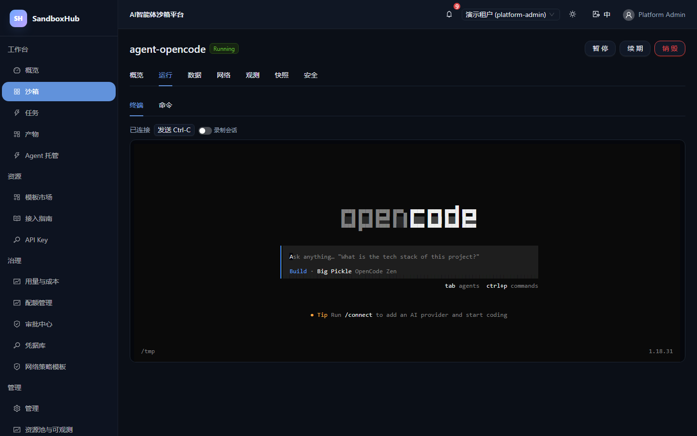

# SandboxHub

**AI智能体沙箱平台**（基于 [OpenSandbox](https://github.com/alibaba/OpenSandbox)）。面向 **开发者自助** 与 **运维 / 租户治理** 的一站式 PaaS：一个入口完成沙箱创建、命令执行、文件管理、Agent 托管、配额审批、审计与观测。

**简体中文** · [English](README.en.md)

---

## 界面预览

在沙箱终端内一键安装并运行 OpenCode 编码 Agent（Agent 托管）：



> 沙箱详情页包含 **概览 / 运行 / 数据 / 网络 / 观测 / 快照 / 安全** 七个标签页；上图为「运行」页内嵌的 Web 终端，已在沙箱内安装并运行 OpenCode 编码 Agent。

---

## 核心能力

### 开发者自助
- **沙箱生命周期**：创建（模板 / 自定义镜像 / 资源限额）、暂停、续期、销毁；列表支持批量操作。
- **运行**：内置 Web 终端（PTY over WebSocket，支持会话录制与回放）、流式命令执行（NDJSON）、文件浏览/上传/下载/在线编辑。
- **模板市场**：内置 Python / Node 等镜像模板，一键带参创建。
- **接入指南 / API Key**：个人 API Key（含有效期）供脚本与 SDK 调用平台 API。
- **任务与产物**：批量创建沙箱执行命令（评测 / 批处理），收集并下载执行产物。
- **Agent 托管**：一键创建沙箱并安装/运行编码 Agent（如 OpenCode）。

### 运维与治理
- **多租户与 RBAC**：平台层逻辑多租户，BFF 强制作用域；自定义角色与权限配置。
- **配额与审批**：租户资源上限、用量统计；大配额 / 出网白名单 / 特权模板走审批中心。
- **凭据库**：安全存储出网凭据引用，注入沙箱而不暴露明文。
- **网络策略模板**：可复用的出网 allow/deny 规则模板。
- **审计与可观测**：操作审计、状态事件实时流、CPU / 内存时序图、资源池与平台用量概览。
- **会话录制**：终端会话录制落库，支持时间轴回放。

### 命令行工具
`apps/cli` 提供 `sandboxhub` 命令，使用 API Key 登录，覆盖沙箱 / 执行 / 文件 / 模板 / Agent / 任务等常用操作。

---

## 架构

```
Browser → nginx(8081) ─┬─ /            → web (React SPA)
                       └─ /api,/realms → BFF(8001) ─→ OpenSandbox Server(8090) → 沙箱(gVisor)
                                           ├─ Keycloak(8180)   认证 / OIDC
                                           ├─ PostgreSQL(5433) 平台元数据
                                           └─ Redis(6380)      会话 / 缓存
```

| 组件 | 端口 | 说明 |
|---|---|---|
| web | 8081 | nginx + React 18 + Vite + Ant Design 5 + ECharts |
| bff | 8001 | FastAPI：认证、RBAC、租户、审计、沙箱、终端、命令、文件、指标、模板、快照、API Key、审批、凭据、策略、录制、资源池、任务、产物、Agent |
| keycloak | 8180 | OIDC（realm `sandboxhub`） |
| postgres | 5433 | 平台元数据 |
| redis | 6380 | 会话与缓存 |
| opensandbox-server | 8090 | 上游沙箱控制面（零改动） |
| 沙箱 | 40000–60000 | 运行中的隔离沙箱实例 |

---

## 目录结构

```
apps/web/      React 前端（约 20 个页面，四组导航）
apps/bff/      FastAPI 后端（BFF + 平台服务）
apps/cli/      sandboxhub 命令行工具
packages/      api-client（生成）/ ui（设计系统）
deploy/        docker-compose / nginx / keycloak / sandbox.toml
docs/          正式文档（决策 / 需求 / 架构 / 数据模型 / API / UI / 运维 / 测试 / 验收）
scripts/       开发与运维脚本（vm.py SSH 助手、e2e-suite.py 等）
imgs/          README 截图
```

---

## 快速开始（部署）

前置：一台 Linux VM（已装 Docker 与 Compose），配置好 SSH 与 `.env`。

```bash
# 1) 同步代码到 VM（本地使用 scripts/vm.py 助手）
python scripts/vm.py sync apps deploy /home/ubuntu/SandboxHub

# 2) 构建并启动全栈
cd deploy
docker compose up -d --build

# 3) 访问
#    http://<VM_IP>:8081
```

更详细的部署、升级与排障见 [docs/ops.md](docs/ops.md)。

---

## CLI 使用

```bash
# 安装（VM 或本地）
uv tool install ./apps/cli        # 或 pip install ./apps/cli

# 登录并验证
sandboxhub login --domain http://<VM_IP>:8081 --api-key <API_KEY>
sandboxhub whoami

# 常用命令
sandboxhub sandbox list
sandboxhub exec <sandbox-id> python -c "print('hello')"
sandboxhub files put <sandbox-id> ./local.txt /tmp/local.txt
sandboxhub templates
sandboxhub agents
```

---

## 文档

| 文档 | 内容 |
|---|---|
| [docs/decisions.md](docs/decisions.md) | 架构决策记录（ADR）与上游硬约束 |
| [docs/user-journeys.md](docs/user-journeys.md) | 用户旅程与验收用例（E2E 对齐） |
| [docs/charter.md](docs/charter.md) | 项目章程 |
| [docs/prd.md](docs/prd.md) | 产品需求 |
| [docs/architecture.md](docs/architecture.md) | 系统架构 |
| [docs/data-model.md](docs/data-model.md) | 数据模型 |
| [docs/api.md](docs/api.md) | BFF API 契约 |
| [docs/ui.md](docs/ui.md) | UI 设计规格 |
| [docs/ops.md](docs/ops.md) | 部署与运维 |
| [docs/test.md](docs/test.md) | 测试与验收策略 |
| [docs/implementation-notes.md](docs/implementation-notes.md) | 关键实现与上游约束笔记 |
| [docs/acceptance-report.md](docs/acceptance-report.md) | 验收报告 |
| [docs/user-manual.md](docs/user-manual.md) | 用户手册 |

---

## 设计原则

- **零改动上游核心**（ADR-002）：所有平台能力在 BFF 层实现。
- **逻辑多租户，BFF 强作用域**（ADR-003）：租户隔离在应用层强制。
- **上游密钥不出 BFF**（ADR-012）：凭据仅注入沙箱，不暴露给前端。
- **每个里程碑以用户旅程 E2E 通过为验收**（[docs/test.md](docs/test.md)）。

---

## 验收状态

- 版本：**v0.1**，已在单台 Linux VM 完成设计、开发、部署与验收。
- E2E：**PASS=11 FAIL=0**（`scripts/e2e-suite.py`），详见 [docs/acceptance-report.md](docs/acceptance-report.md)。
